#  n8n 安装与配置 
# 一、n8n 简介

n8n 是一个开源的自动化工作流工具，用于连接不同的应用程序和服务，实现任务的自动化。“n8n”是“nodemation”的缩写，它采用节点式（node-based）的可视化界面，用户可以通过拖拽节点来设计复杂的工作流。相较于Dify和扣子，n8n 的优势在于其强大的通用工作流自动化能力，能深度集成数百种应用并支持自定义代码，适合构建复杂、跨系统的非 AI 主导的自动化流程。
[n8n的开源地址](https://github.com/n8n-io/n8n?tab=readme-ov-file)

## n8n 官方安装和启动方式
- 通过 npx n8n 快速启动（Node.js）：
```bash
npx n8n
``` 
- 通过 Docker 部署
```bash
docker volume create n8n_data
docker run -it --rm --name n8n -p 5678:5678 -v n8n_data:/home/node/.n8n docker.n8n.io/n8nio/n8n
``` 
> 💡 Tip  
> 因为npx n8n方式启动默认不保存任何数据！关闭后所有工作流、凭证都会丢失（除非你配置数据库）。同时，Docker运行在一个独立的容器中，内置完整环境（Node.js + n8n + 依赖），完全不受主机影响，更适合生产环境和长期使用。所以本次学习选择通过Docker部署安装~

# 二、Docker 安装步骤

## 下载 Docker 安装包
> 💡 Tip  
> 按需下载就好了~

- Mac Apple 芯片：
- Mac Intel 芯片
- Windows 安装包

## 安装 docker @Windows

### 启动 Hyper-V
1. 打开**控制面版 -> 程序 -> 程序和功能**
2. 访问**程序和功能**子菜单**启动或关闭 Windows 功能**
3. 选择“**Hyper-V**"
4. 点击“确定”
5. 重启


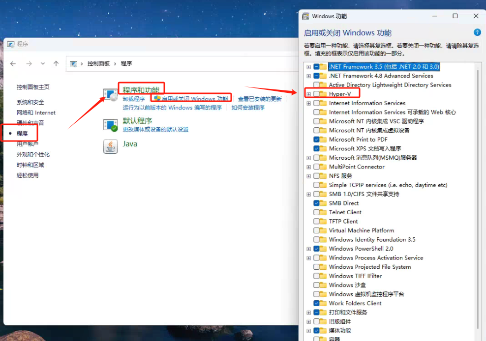

> 💡 Tip  
> !!!fold!!! 如果没有 Hyper-V 详见这篇材料：https://zhuanlan.zhihu.com/p/586751199 可以查询一下电脑是否已经开启虚拟化

### 安装 docker 桌面版
> 💡 Tip  
> 直接双击打开安装包进行安装即可，具体安装过程略 ⚠️：注意不要修改安装目录

**安装过程中出现提示“无法与服务器建立连接”时，可以手动下载安装 wsl：**

_基于 x64 架构的 Windows 系统，下载 _wsl.2.4.13.0.x64.msi _基于 ARM64 架构，需下载 _wsl.2.4.13.0.arm64.msi

## 安装 docker @Mac
> 💡 Tip  
> 下载完成后直接安装即可~
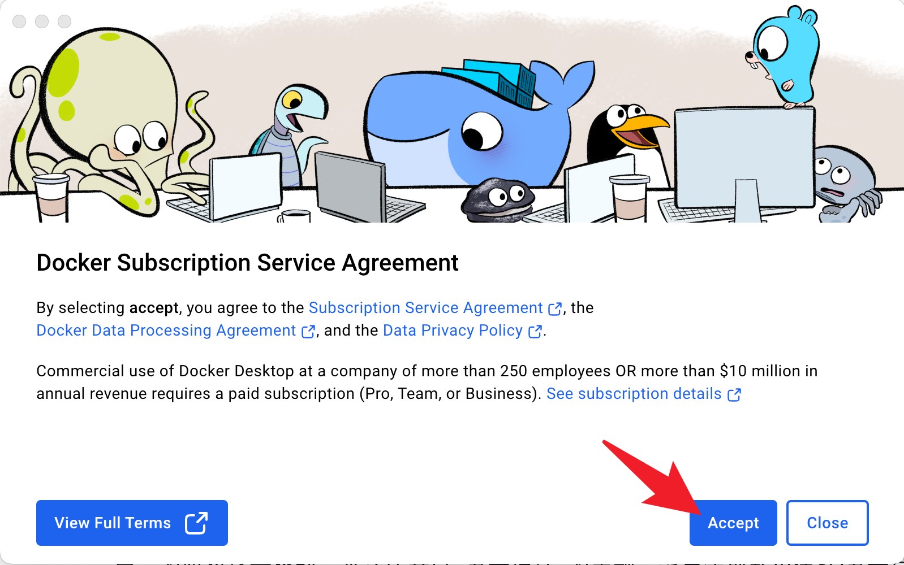
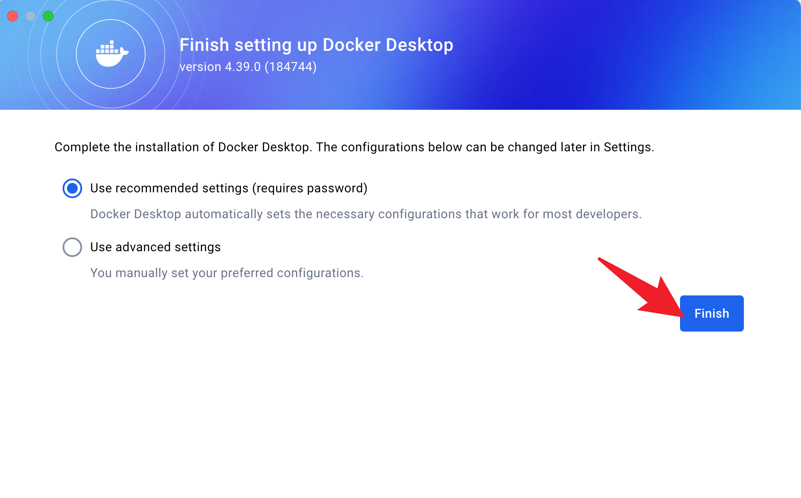
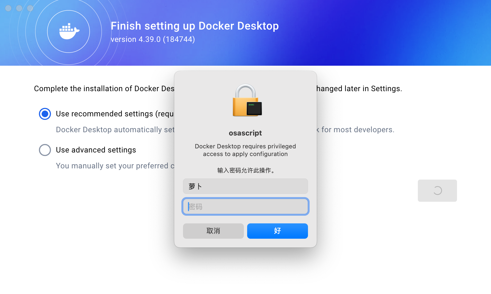
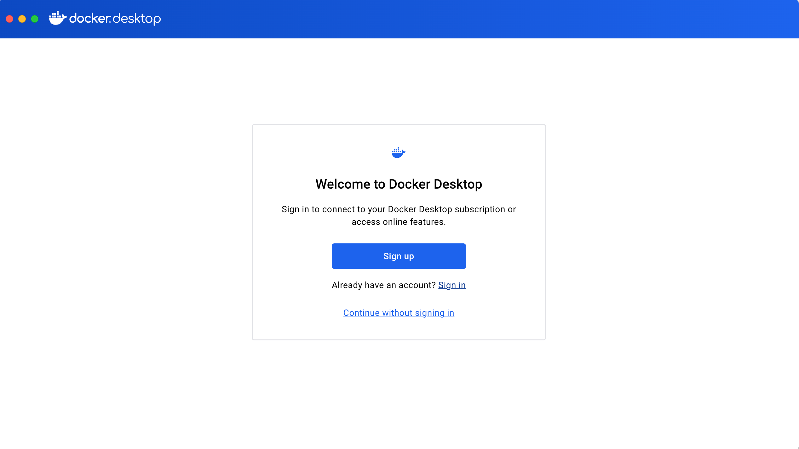
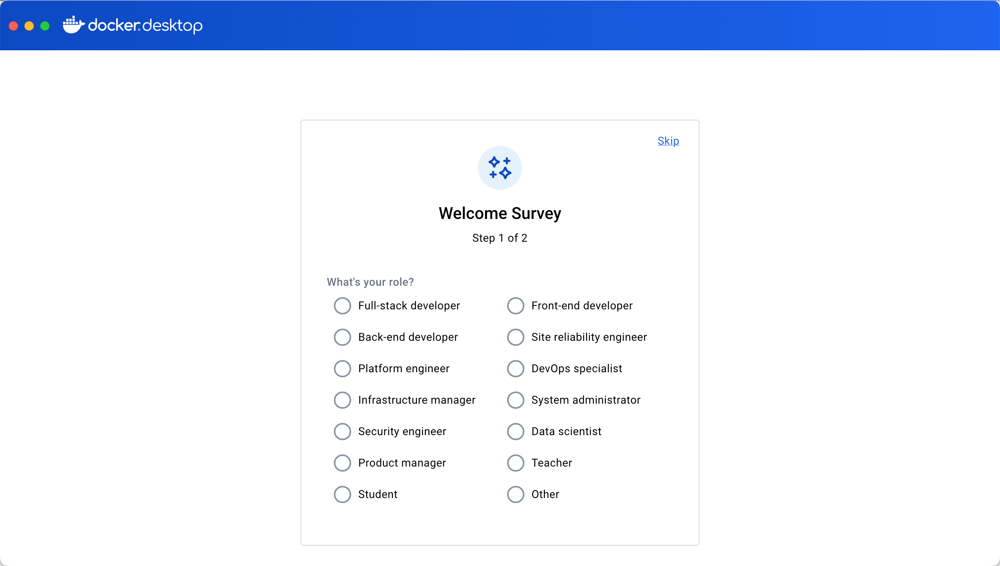

## 安装 docker @Linux
> 💡 Tip  
> 如果使用Linux系统或通过Linux云主机部署可以参考 https://zhuanlan.zhihu.com/p/1919709942706837199


# 三、启动 Docker
## 启动 Docker
> 💡 Tip  
> 直接 双击/单击 启动 docker 即可，不需要登陆

Windows 电脑：直接在桌面、 双击 启动 docker 即可

Mac 电脑：⌘+ 空格，搜索“docker”，打开使用
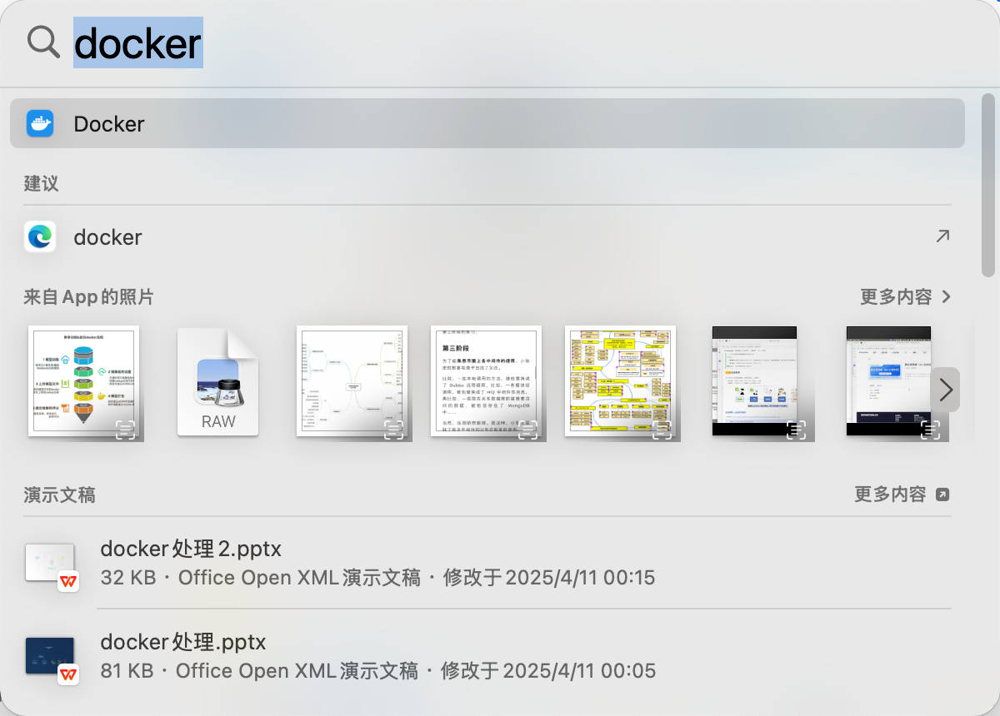
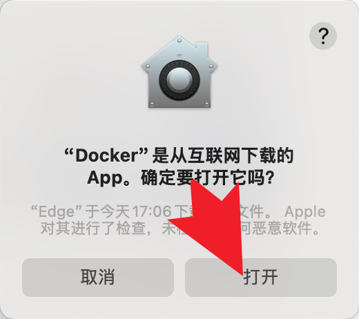
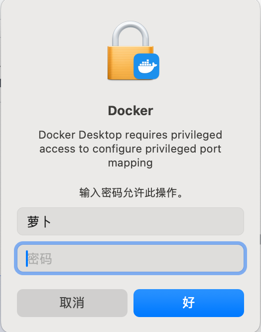

## Docker 换源
> 复制这段代码：
```json
"registry-mirrors": [
  "https://docker.lms.run",
  "https://docker.xuanyuan.me",
  "https://hub-mirror.c.163.com",
  "https://mirror.baidubce.com",
]
```

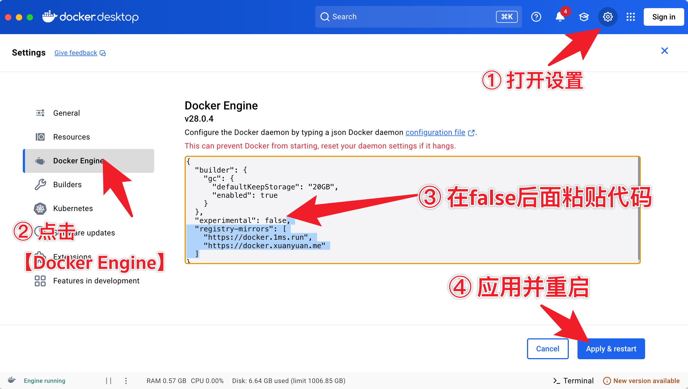

docker部署参考：https://github.com/datawhalechina/self-dify/tree/main

# 四、n8n本地docker部署

打开Powershell，执行以下命令：
> 
>创建存储卷
>```bash
>docker volume create n8n_data
>```
>启动和使用n8n
>```bash
>docker run -it --rm --name n8n -p 5678:5678 -v n8n_data:/home/node/.n8n docker.n8n.io/n8nio/n8n
>```
命令运行正常就开始下载 docker 镜像（如下图)

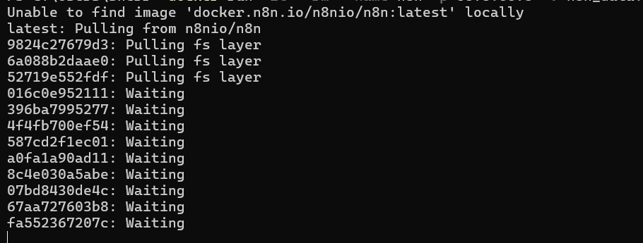

执行完成后通过docker ps检验n8n是否安装成功，如果显示下图类似容器，则安装成功

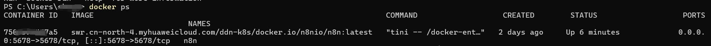

也可以通过docker.desktop检查是否成功

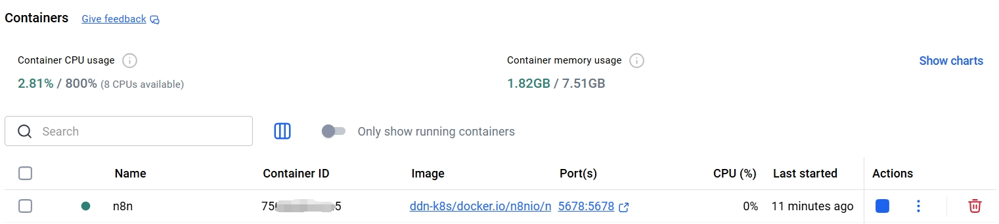
> 💡 Tip  
> 执行启动和使用n8n命令进行安装时，可能有以下报错：
> ```bash
>docker: Error response from daemon: Get "https://registry-1.docker.io/v2/ ": context deadline exceeded
>```
> 以上报错多是因为是网络被墙或 DNS 污染导致的。可以改执行以下命令（以Windows系统为例，macOS / Linux用“\”代替“`”做续行符）
> ```bash
>docker volume create n8n_data
>docker run -d `
>    --name n8n `
>    -p 5678:5678 `
>    -e GENERIC_TIMEZONE="Asia/Shanghai" `
>    -e TZ="Asia/Shanghai" `
>    -v n8n_data:/home/node/.n8n `
>    docker.n8n.io/n8nio/n8n
>```
> 参考：https://github.com/datawhalechina/handy-n8n/blob/main/c02/local-pc-deploy.md

# 五、开启n8n之旅！
> 💡 Tip  
> 打开 http://localhost:5678 即可看到 n8n 页面 恭喜你已经完成了 n8n 部署！（首次登陆n8n会需要填写一些问题并要求填写你的Email，最好别跳过并填写自己的真实Email，因为n8n会给一个license到你的邮箱，激活后可以获得更多功能，千万别错过呦~）

 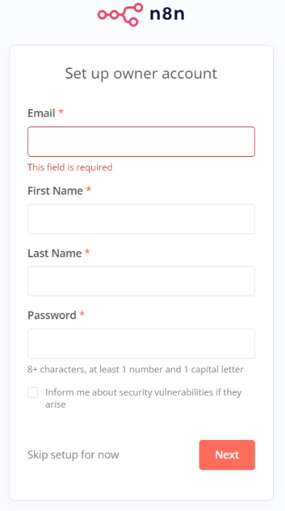
