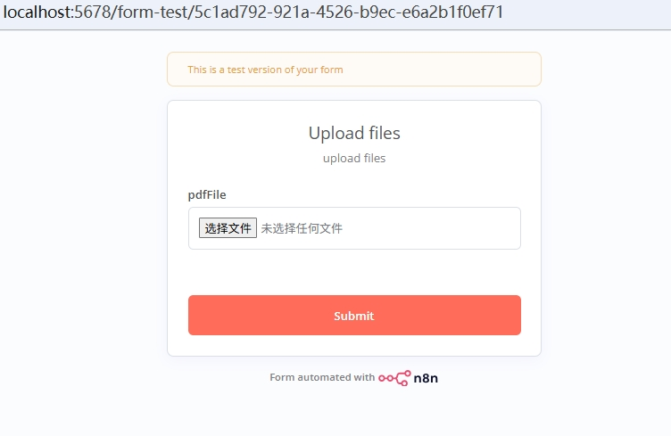
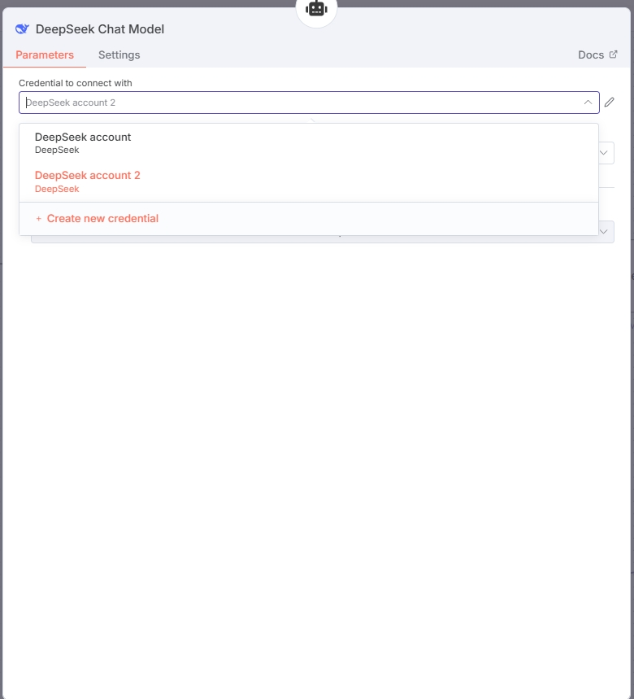

#  进阶-知识库：新生入学指南助手 
刚入校园，希望能有小助手帮我们快速了解学生手册，这需要我们常说的检索增强生成（RAG）了。检索增强生成（RAG）是一种通过将语言模型与外部数据源相结合的技术，整个 RAG 系统主要包含两条核心工作流：

- 工作流一：数据写入向量数据库 (构建知识库)
- 工作流二：结合知识库进行问答 (RAG 查询)
# 一、创建知识库
## 添加文件上传节点
我们需要先添加一个“触发节点”，因为需要上传pdf，我们选择表单触发节点“On form submission”作为流程起点

添加节点后，点击该节点配置参数：
- Form Title & Form Description: 是该表单的名称和描述
- Field Name：为文件字段名
- Element Type：选择File
- Multiple Files：如果开启可以一次上传多个文件
- Accepted File Types：该参数是可支持文件类型，支持多种文件类型，文件类型之间用英文逗号隔开（例如：.pdf,.md）


设置完成后，我们可以测试该节点是否可以正常工作：

- 点解测试按钮（每个节点的测试按钮类似编程中的debug)


- 上传文档
  


- 上传成功后右下角会提示节点操作成功，再次点击“On form submission”节点，可以看到我们上传成功的文档


## 添加向量数据库节点
在节点搜索栏中检索"vector"会显示n8n支持的向量库，pinecon和Qdrant比较常用，本次使用的是最基础的向量节点的“Simple Vector Store"


点击添加“Simple Vector Store"节点，因为我们上一个节点接收的是PDF所以选择“Add documents to vector store”


添加后，是一个未配置的向量节点与上一个文件接受节点相连


### 配置向量节点参数

点击新增的向量节点，需要配置Memory Key，该参数是每个向量库的UID，后期RAG查询需要该参数识别需要查询的向量库。


点击向量节点左下方的“Embeddings”，配置节点的向量模型，n8n提供的向量中大部分国内不支持，所以，我们选择安装ollama，在本地部署一个qwen3-embedding-4b并调用。


### ollama本地部署qwen3-embedding-4b
1. ollama 安装，参考：https://www.runoob.com/ollama/ollama-install.html
2. 在ollama中导入qwen3-embedding-4b模型
- 下载模型的gguf文件 https://hf-mirror.com/Qwen/Qwen3-Embedding-4B-GGUF/tree/main


- 将文件放置在你指定的路径下（该路径不要出现中文）以“D:\model”举例，执行以下命令
```bash
echo FROM D:\model\Qwen3-Embedding-4B-Q4_K_M.gguf
echo PARAMETER modality text
echo TEMPLATE ""

cd /d D:\model
ollama create qwen3-embedding-4b -f Modelfile
```
- 执行完成后通过 ollama list检验是否加载成功，如果执行后出现“qwen3-embedding-4b:latest”就加载成功

### 配置Embeddings
完成以后可以回到n8n的“Embeddings”添加，选择“Embedding Ollama",再点击新增的 “Embedding Ollama"节点配置参数:

- 未配置过的需要点击"Create new credential"添加


- Base URL：“http://192.168.X.X:11434”
> 💡 Tip  
>“192.168.X.X”是你IPV4的地址，如果不知道可以通过在CMD中执行ipconfig查询。（这里不使用localhost，是因为在容器里localhost指向的是容器自己，而不是宿主机, 在n8n中会出现报错，链接失误)

- 点击“retry”测试是否成功


- 测试成功后，等2-3s就可以看到我们刚刚加载的模型
  


### 配置Document
该部分主要用于配置文档切割的参数

在“Document”添加“Default Data Loader”


如图配置“Default Data Loader”参数：


为“Default Data Loader”添加文档分割器Recursive Character Text Splitter：


配置“Recursive Character Text Splitter”参数

- chunk size是切割后每个文档的大小
- chunk overlap为切割后每个文档重叠部分大小，可以根据需要决定。


完成以上配置，执行execute workflow，显示执行成功，构建知识库就完成了


# 二、RAG查询


## 添加Chat节点
在节点搜索框中输入'Chat Trigger'并添加

## 添加Agent节点
在'Chat Trigger'之后添加“AI Agent"节点

### 配置Chatmodel

- 添加查询模型，以deepseek为例


- 首次配置需要选择“+ Create new credential”
  


- 登陆deepseek官网获取API-KEY并填入
  


- Model要选择chat模型


### 连接向量库

添加“Answer questions with a vector store”节点，该节点把「向量数据库」封装成 LangChain Tool，供 AI Agent 或问答链调用，所以需要对其作用进行说明，limit参数代表单次检索返回的文档片段数，默认是4，“Answer questions with a vector store”的模型也是chat模型，所以不需要在添加一个节点，将其和之前的deepseek连接就好。


在“Answer questions with a vector store”下方添加"Simple Vectore Store"节点，需要注意“Memory Key”要和之前设置的保持一致，"Simple Vectore Store"节点的embedding模型也要和之前的一致，可以直接连接。


完成以上步骤，点击“Execute Workflow”，再点击“Open Chat"，便可以询问你的小助手了~


